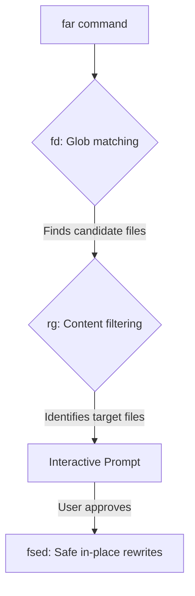

# Building `far`: Bringing IDE-Grade Find & Replace to the Terminal

We've all been there: you need to rename a class, refactor an API, or update configuration values across dozens of files. 

Traditionally, this meant constructing a brittle, scary shell pipeline:
```bash
find . -name "*.cpp" -print0 | xargs -0 sed -i 's/OldClass/NewClass/g'
```

If you make a single typo or miscalculate the regex syntax, this one-liner can quietly corrupt your entire project directory. Standard `sed` behaves differently on macOS and Linux, backup flag syntax varies, and there is no way to preview the changes safely.

I wanted something better. I wanted a single, fast, safe command that feels like the classic IDE "Find and Replace across Files" dialog, but runs natively in the terminal.

So, I built [far](https://github.com/cschladetsch/ShFar).

---

## 🛠️ The Architecture: An Elegant Orchestrator

`far` does not try to reinvent the wheel. Instead, it acts as a lightweight orchestrator that wires together three best-in-class tools:

1. **`fd` (File Discovery)**: The modern replacement for `find`. It scans your project directory using a simple glob syntax and extreme parallel speed.
2. **`rg` (Ripgrep - Filtering)**: The fastest pattern search engine in existence. It filters the files discovered by `fd` to only target files containing the specific search pattern.
3. **`fsed` (The Engine)**: A native, high-performance C++23 stream editor bundled as a git submodule ([CppSed](https://github.com/cschladetsch/CppSed)). Using a custom-built stream engine ensures that regex features, capture-group backreferences, and case conversions remain 100% consistent across operating systems.



---

## 🛡️ Safety & Developer Experience (UX) First

With global code replacements, mistakes are costly. `far` is designed with deep safety defaults:
*   **Interactive Confirmation by Default**: Before modifying any files, `far` stops and shows you a list of matching files, asking for your explicit approval before performing writes.
*   **Dry Runs (`-n`)**: Run a search and view matching lines and paths safely without writing a single byte.
*   **Automatic Backups (`-b`)**: Automatically generates `<filename>.bak` copies of your files before editing, giving you a clear safety net.
*   **CI-Pipeline Ready (`-y`)**: Skip prompts programmatically for automation scripts while ensuring that if no files match, the command exits with a clean, descriptive error code instead of silently failing.

---

## 🏫 Interactive Training Playground

Learning regex and backreference replacements shouldn't feel like guessing. To help developers practice safely, `far` includes a built-in training playground.

Running `./teach` or `python3 playground_server.py` boots up a compact, single-screen dashboard local server at `http://127.0.0.1:8765`.


*   **Interactive Testing**: Type in your glob patterns and replacement expressions, and see immediately which files in the repository's `demo/` folder are affected and what the resulting lines look like.
*   **Safe Playground**: The dashboard is strictly read-only for file updates, training you in the command-line syntax so you can run it confidently in your actual shell.
*   **Easy Reset**: Messed up the sandbox? Simply run `git restore demo/` to start fresh.

---

## 🎯 Wrap Up

`far` proves that powerful refactoring tools don't have to be bloated or complex. By chaining `fd`, `rg`, and our C++23 `fsed` engine under a safe, intuitive Bash interface, we turn a stressful shell incantation into a reliable, single-word tool you can use every single day.

*Explore the syntax and command examples in [README.md](README.md) or launch the training dashboard to try it out!*
