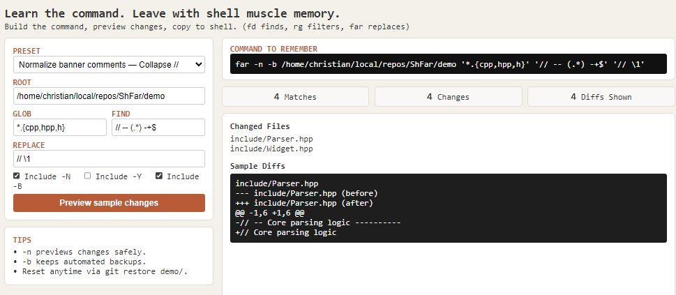

# far

**Find and replace across files** -- a CLI tool combining [`fd`](https://github.com/sharkdp/fd), [`rg`](https://github.com/BurntSushi/ripgrep), and bundled `fastsed` for targeted in-place substitution.

```bash
far . '*.cpp' 'OldClass' 'NewClass'
far . '*.cpp' 'OldClass' 'NewClass' ./src
far -n '*.h' 'TODO' 'FIXME'        # dry run
far -y -b '*.txt' 'foo' 'bar'      # skip prompt, write backups
```

## Demo

Comes with a small teaching aid: it is basically just a way to combine `fd`, `rg`, and `fsed`.



## Why

`fd` is the modern replacement for `find` -- faster, with saner glob syntax.
`rg` is the fastest way to find candidate files containing a string.
`fastsed` does the actual in-place substitution, so regex and replacement
semantics stay under one engine you control. `far` wires the pieces together
with a confirmation step, dry-run mode, and optional backups so you don't
shoot yourself in the foot.

## Dependencies

| Tool | Purpose |
|------|---------|
| [`fd`](https://github.com/sharkdp/fd) | Fast filename glob matching |
| [`rg`](https://github.com/BurntSushi/ripgrep) | Fast parallel file content search |
| Bundled `fastsed` / `fsed` | In-place substitution |
| `bash` | Runtime |

`bash` is standard on POSIX systems. Install `fd` and `rg` via your package manager:

```bash
# macOS
brew install fd ripgrep

# Debian / Ubuntu
apt install fd-find ripgrep

# Arch
pacman -S fd ripgrep

# Cargo
cargo install fd-find ripgrep
```

## Installation

```bash
git clone https://github.com/cschladetsch/far.git
cd far
git submodule update --init --recursive
sudo ./install.sh
```

Custom install paths:

```bash
sudo ./install.sh /usr/local/bin /usr/local/share/man/man1
```

The installer will:
- Build the bundled `CppSed` submodule
- Install `fsed`, `far`, and both man pages
- Check that `fd` and `rg` are present
- Copy `far` to the bin directory
- Update the man database
- Warn if the bin directory is not in `PATH`

## Playground

The local playground is the recommended way to learn `far` argument order and
preview a command before you run it manually in your shell.

```bash
python3 playground_server.py
```

Then open `http://127.0.0.1:8765`.

Or use the helper:

```bash
./teach
```

- It defaults to the repo's `demo/` folder so you can experiment safely.
- It previews real local files, but only shows sampled diffs so the command
  stays the main artifact.
- It does not run writes from the browser in v1; the goal is to train you to
  copy the command and use `far` directly in the shell.

Reset the demo folder after experimenting:

```bash
git restore demo/
```

## Usage

```
far [OPTIONS] <root> <glob> <find> <replace>
```

### Arguments

| Argument | Description |
|----------|-------------|
| `root` | Directory to search under (use `.` for current directory) |
| `glob` | Filename glob pattern, e.g. `*.cpp` |
| `find` | Text or regex to search for |
| `replace` | Replacement string |

### Options

| Flag | Description |
|------|-------------|
| `-y` | Skip the confirmation prompt |
| `-n` | Dry run -- list matching files, make no changes |
| `-b` | Write `.bak` backups before modifying |
| `-h` | Show help |

### Exit codes

| Code | Meaning |
|------|---------|
| `0` | Success |
| `1` | Invalid arguments |
| `2` | No matching files found |
| `3` | User aborted at confirmation prompt |

## Examples

**Rename a class across all C++ source files:**

```bash
far . '*.cpp' 'OldClass' 'NewClass'
```

**Restrict to a subdirectory:**

```bash
far . '*.cpp' 'OldClass' 'NewClass' ./src
```

**Preview without modifying anything:**

```bash
far -n . '*.h' 'OldClass' 'NewClass'
```

**Apply immediately with no prompt, keeping backups:**

```bash
far -y -b . '*.cpp' 'OldClass' 'NewClass'
```

**Bump a version string across all Markdown docs:**

```bash
far -y ./docs '*.md' 'v1.0.0' 'v1.1.0'
```

**Replace a deprecated API call across all headers and sources:**

```bash
far . '*.{h,cpp}' 'GetValue()' 'getValue()'
```

**Normalize banner comments with a capture group:**

```bash
far . '*.{cpp,h}' '// -- (.*) -+$' '// \1'
```

**Fix a misspelled identifier across Python files:**

```bash
far . '*.py' 'recieve' 'receive'
```

**Update a changed environment variable name across shell scripts:**

```bash
far ./scripts '*.sh' 'APP_ROOT' 'APP_BASE_DIR'
```

**Rename a CMake target across build files:**

```bash
far . 'CMakeLists.txt' 'mylib_static' 'mylib'
```

**Use in a CI pipeline (non-interactive, fails loudly on no match):**

```bash
far -y ./docs '*.md' 'UNRELEASED' '2.0.0'
```

## Caveats

- `fd` is used for filename glob matching; `rg` is used for content search. Both must be in `PATH`.
- `find` is matched by `rg`, and replacement is performed by bundled `fastsed` (`fsed`) using extended regex syntax and replacements like `\1`.
- Strings containing `/` or `&` may need escaping depending on your pattern and replacement.
- For slash-heavy patterns, `far` also tolerates a leading delimiter slash, so forms like `'/\\/\\/ -- '` work.
- Without `-b` there is no undo. Use `-n` first when in doubt.
- `rg` respects `.gitignore` by default, so files excluded from version control are skipped.

## Man page

```bash
man far
```

## License

MIT -- see [LICENSE](LICENSE).
