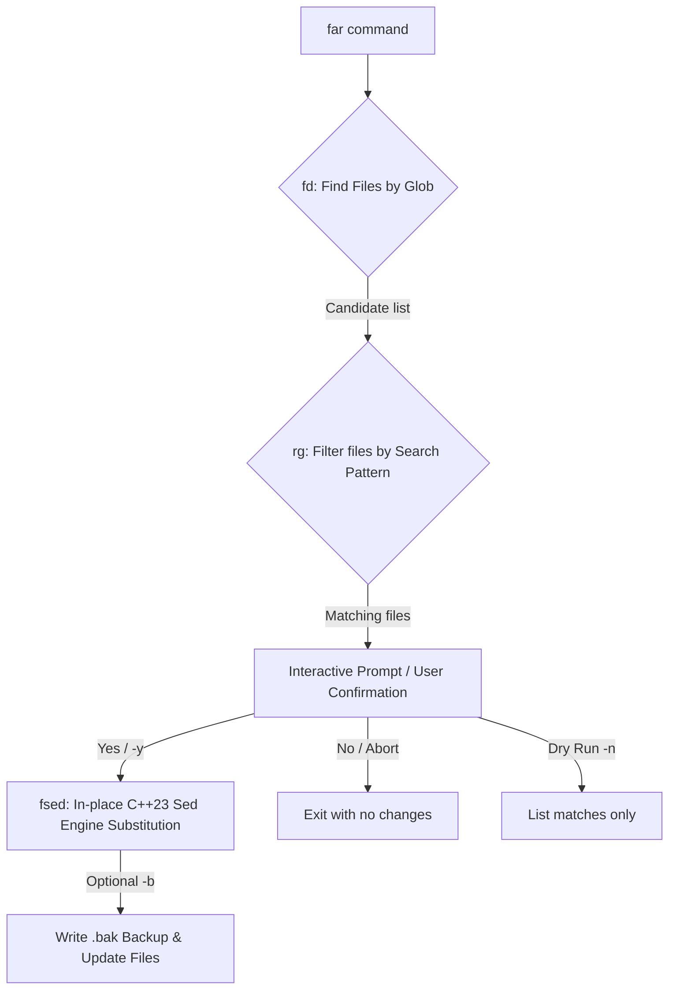

# ShFar / far

[](LICENSE)
[](#dependencies)

**Find and Replace across Files** -- A high-efficiency CLI tool combining the speed of [`fd`](https://github.com/sharkdp/fd), the parallel searching power of [`rg`](https://github.com/BurntSushi/ripgrep), and the high-performance in-place replacement capability of bundled C++23 [`fastsed`](https://github.com/cschladetsch/CppSed) (`fsed`).

---

## 💡 The Relationship: Orchestrator vs. Engine

Refactoring code across multiple files with standard tools (`find`, `xargs`, `sed`) can be error-prone and hard to remember. `far` solves this by wrapping the pipeline into a single, cohesive command workflow:

1. **`far` (The Orchestrator)**: Wired in Bash, it manages user interaction, processes command-line flags, finds target files, prompts you for confirmation, and coordinates the execution steps.
2. **`fsed` (The Engine)**: A native C++23 stream editor bundled as a git submodule (`CppSed`). `far` delegates the actual regex substitution to `fsed`, ensuring safe, fast, and cross-platform compatible replacements with consistent regex behavior (including capture group backreferences and case conversions).

---

## 🔄 How far Works (Pipeline Flow)



---

## ⚡ Prerequisites & Installation

### Core Dependencies
Ensure the following tools are installed on your system:

| Tool | Minimum Version | Purpose | Installation |
| :--- | :--- | :--- | :--- |
| `fd` | v8.0+ | Fast filename glob matching | `apt install fd-find` / `brew install fd` |
| `rg` | v13.0+ | Fast parallel file content search | `apt install ripgrep` / `brew install ripgrep` |
| `bash` | v4.0+ | Runtime shell environment | Standard on Linux / macOS |

### 🛠️ Installing far

To install `far` along with its C++23 replacement engine (`fsed`) submodules:

```bash
# Clone the repository
git clone https://github.com/cschladetsch/far.git
cd far

# Initialize and pull the fastsed C++ submodule
git submodule update --init --recursive

# Run the installer (compiles fastsed, installs far + fsed binaries and man pages)
sudo ./install.sh
```

*Note: The installer automatically verifies your dependencies (`fd`, `rg`), builds the bundled `CppSed` codebase, copies `fsed` and `far` to your target binary path, and updates your system manuals.*

---

## 🎯 Command-Line Reference

```
far [OPTIONS] <root> <glob> <find> <replace>
```

### Position Arguments
| Argument | Type | Description |
| :--- | :--- | :--- |
| `<root>` | Directory Path | The directory path to search under (e.g. `.` for the current directory). |
| `<glob>` | Shell Pattern | Filename glob pattern to match (e.g. `'*.cpp'`, `'*.{h,hpp}'`, or `'*.py'`). |
| `<find>` | Regular Expression | The text pattern or regular expression to search for. |
| `<replace>`| Substitution String | The replacement string (supports backreferences like `\1` and case conversions). |

### Flags & Options
| Flag | Name | Description |
| :--- | :--- | :--- |
| `-y` | Non-Interactive | Skips the confirmation prompt and applies substitutions immediately. |
| `-n` | Dry Run | Performs a preview pass: lists matching files and target lines without editing. |
| `-b` | Create Backups | Automatically creates a `<filename>.bak` backup file before modifying any file. |
| `-h` | Help | Displays help and usage guidelines. |

### Exit Status Codes
*   `0`: Success (changes applied or dry run executed successfully).
*   `1`: Invalid command arguments.
*   `2`: No matching files were found containing the search pattern.
*   `3`: Modification aborted by user at the confirmation prompt.

---

## 📚 Categorized Examples

### 1. Basic Replacements
```bash
# Rename a class across all C++ source files (will prompt before writing)
far . '*.cpp' 'OldClass' 'NewClass'

# Restrict replacement scope to a specific subfolder
far . '*.cpp' 'OldClass' 'NewClass' ./src
```

### 2. Safe Experimentation & Dry Runs
```bash
# Dry run: view what files contain 'TODO' and would change to 'FIXME'
far -n . '*.h' 'TODO' 'FIXME'

# Perform in-place updates immediately, but preserve original backups
far -y -b . '*.txt' 'temporary_key' 'permanent_key'
```

### 3. Advanced Regex & Capture Groups
Because `far` utilizes the modern C++23 `fsed` engine under the hood, you can leverage advanced regex features, capture groups, and case-modification flags:

```bash
# Reformat comments while keeping dynamic content using capture groups (\1)
far . '*.{cpp,h}' '// -- (.*) -+$' '// \1'

# Swap argument order and convert variable names to uppercase (\U...\E)
far . '*.py' 'load_config\(([^,]+),\s*([^)]+)\)' 'load_config(\U\2\E, \1)'
```

### 4. Automation & CI Pipelines
```bash
# Non-interactive string replacement for release deployment
far -y ./docs '*.md' 'DRAFT_VERSION' 'v2.1.0'
```

---

## 🏫 Interactive Training Playground

`far` features a local, lightweight playground to help you master multi-file substitutions safely before using the tool on live repositories.


### Launching the Dashboard

Run the playground local server from the repository root:
```bash
# Using Python directly
python3 playground_server.py

# Or run the native teacher helper script
./teach
```

Then open your browser and navigate to: **`http://127.0.0.1:8765`**

### Playground Rules
*   **Sandbox Safety**: It is pre-configured to point to the repository's `demo/` folder, allowing you to test complex glob patterns and regex operations safely.
*   **Safe Exploration**: It parses and previews matches and substitutions in real-time but does *not* write to the filesystem directly from the browser, teaching you the command syntax to run in your shell.
*   **Reset Sandbox**: If you ever want to reset the playground files back to their default state:
    ```bash
    git restore demo/
    ```

---

## 📄 Manual Reference
To access full manual guidelines directly from your terminal:
```bash
man far
man fsed
```
